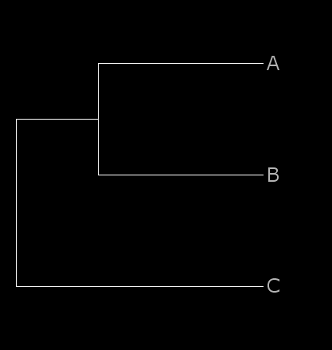
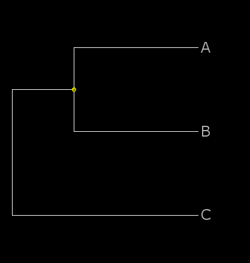
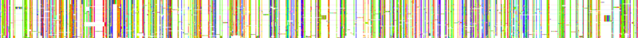
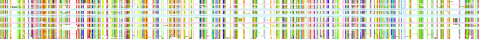
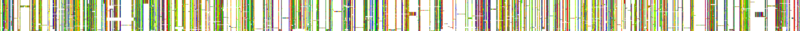
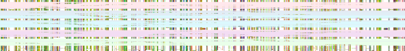

PAGAN: guided placement<a name="top"></a>
=======================
 

PAGAN extends existing alignments by aligning the new sequences to their phylogenetic positions in the reference alignment. If the phylogenetic positions of the query sequences are known (e.g. the species in question is an outgroup for the clade X), this information can be provided for the placement. PAGAN allows naming multiple alternative positions for the sequences (because the precise position is not known or the reference contains paralogous genes and the copies which the sequences come from are not known) and it will then choose the one where the sequences matches the best.

This page explains guided placement. See [here](pagan_phylogenetic_placement.md) for unguided phylogenetic placement.

---

* [Guided placement with assignment of queries to specific nodes](#guided-placement-with-assignment-of-queries-to-specific-nodes)
* [Use of Archaeopteryx-PAGAN-Edition](#use-of-archaeopteryx-pagan-edition)
* [Examples of guided placement](#examples-of-guided-placement)
  * [Example of guided placement of protein sequences](#example-of-guided-placement-of-protein-sequences)
  * [Example of guided placement of NGS reads](#example-of-guided-placement-of-ngs-reads)
* [454 and PacBio data](#454-and-pacbio-data)

[Back to PAGAN front page](../README.md)

---

#### Guided placement with assignment of queries to specific nodes

The minimal command to perform guided sequence placement is:

```
pagan --ref-seqfile ref_alignment_file --ref-treefile ref_tree_file --queryfile query_sequence_file --guided
```
   
However, guided placement requires certain changes in the input data.  
 

Sequences are assigned to a specific node or a set of nodes using the NHX tree format with an additional tag TID; the same tag is then given for the query sequences. The tag identifier can be any string, in the example below we use number 001. One can use any number/combination of tags as long as each node and each sequence has at most one tag.

As an example, let’s assume

a reference alignment:

```
>A
CGTCCAATCATACTTGCGCAGGCGGTTTCACAGAACAACCTACTTTCTGT
CCTTCTGACAATGGTGGTCG
>B
CGTCCCATCATAATCGCGCAGGTGGTTTCACAGAACAACCTACTTTCTGT
CCTTCTGACAATGGTGCTCG
>C
CGTCCCATCGTCATTGCGCAGTCTGTTTCACAGAACAACCTACTCTCTGT
CTTTCTGACAATGGTGCCCA
```

and a query that we want to add in FASTA:

```
>D TID=001
CTTGCGCAGGCGGTTTCACAGAACAACCTACTTTCTGTCCTTCTGACA
```

or in FASTQ format:

```
@read_D_0001@3@15@13524@18140#0/1 TID=001
CTTGCGCAGGCGGTTTCACAGAACAACCTACTTTCTGTCCTTCTGACA
+
CCCCCCCCCCCCCCCCCCCCCCCCCCCCCCCCCCCCCCCCCCCCCCCC
```

The placement of the query in the reference alignment depends on the format of the reference tree:

a phylogeny in plain Newick format triggers the placement search and adds the query to the node with the best hit:

```
((A:0.1,B:0.1):0.05,C:0.15);
```

a phylogeny in NHX format with one matching label adds the query to that node:

```
((A:0.1,B:0.1):0.05[&&NHX:TID=001],C:0.15);
```

a phylogeny in NHX format with several matching labels finds the best node and adds the query to that:

```
((A:0.1,B:0.1):0.05[&&NHX:TID=001],C:0.15):0[&&NHX:TID=001];
```

With ArchaeopteryxPE, the target nodes are shown with yellow dots and the three tree files look like this:





By default, PAGAN places a query sequence to multiple locations if more than one location shares the best score. This can be changed with option ```--one-placement``` that places the query only once, at the deepest (or last) node among the possible placements.

#### Use of Archaeopteryx-PAGAN-Edition

The NHX phylogeny format used for the tagging of target nodes for guided placement is unique for PAGAN. To facilitate the preparation and visualisation of the reference phylogenies, we have modified Archaeopteryx, the superb phylogeny visualisation program by Christian M Zmasek, to understand the PAGAN-specific tags and allow for their editing. The original Archaeopteryx program and documentation for its use can be found at [http://phylosoft.org/archaeopteryx/](http://phylosoft.org/archaeopteryx/).

The Archaeopteryx-PAGAN-Edition (here abbreviated as ArchaeopteryxPE) has one additional feature compared to the original program: the program can read, display, edit and write NHX files containing TID=<string> tags used for guided sequence placement with PAGAN. For any other purposes of tree display or editing you should use an up-to-date version of the original Archaeopteryx program. ArchaeopteryxPE is available as [Java jar-file](../binaries/other_files/archaeopteryxPE.jar) at the [download page](../binaries/other_files/) and can then be started with the command:

```
java -jar archaeopteryxPE.jar [reference.nhx]
```
    
where the optional argument 'reference.nhx' specifies a phylogeny file. (An example of a [valid tree file](../binaries/other_files/reference.nhx) is available at the [download page](../binaries/other_files).) This command assumes that the ArchaeopteryxPE program is located in the same directory; if not, type:

``` 
java -jar /path/to/dir/with/archaeopteryxPE.jar reference.nhx
```
    
The source files modified to provide the necessary functionality are included in a [separate file](../binaries/other_files/archaeopteryxPE.modified_files.src.tgz). This is provided to comply with the GPL and is not needed by a typical user.

The tree in the example file provided contains two types of NHX tags, D=Y and TID=0\[12\]. The red dots indicate duplication nodes (D=Y) and yellow dots the PAGAN target nodes (TID=01 or TID=02). If a yellow node is clicked, a panel with the node data, including the PAGAN TID, is opened. To edit an existing TID tag or add a new tag at another node, the node has to be right-clicked and then "Edit Node Data" selected. This will open an edit panel with the PAGAN TID field in the bottom. The text-insert mode can be activated by clicking (repeatedly) the text field on the right side of the page icon. When saving the tree file, the NHX format can be selected from the file format drop-down menu.

### Examples of guided placement

The PAGAN download files contain example datasets for guided placement of protein sequences (full length and fragments) and NGS reads. The datasets can found in directories [examples/protein_placement](../examples/protein_placement) and [examples/ngs_placement](../examples/ngs_placement).

The idea of guided placement is to extend existing alignments with new sequences for which the (rough) phylogenetic location is known. The situation may be complicated by paralogous genes and uncertainty of the right target for the new sequences. For such cases, PAGAN allows indicating several potential targets and then chooses the best location by aligning the query sequences to each specified target.

The examples are based on simulated data. In these examples, we have reference alignments that include gene sequences from several mammals; the hypothetical gene has duplicated first in the ancestor of primates and rodents and then again in the ancestor of rodents. Our new sequences come from a primitive primate, believed to belong phylogenetically between tarsier and lemur, and a rodent, belonging between guinea pig and ground squirrel. Because of the gene duplications, the primate and rodent sequences have two and three potential target locations, respectively, in the phylogeny. These are indicated in the reference phylogenies using special TID tags. The phylogenies and the target locations for guided placement can be viewed and edited with the ArchaeopteryxPE software. ArchaeopteryxPE indicates the duplication nodes with red dots and the TID target nodes with yellow dots and the guide phylogeny looks like this:


When sequences are placed with PAGAN, it first tries placing each query sequence to every matching target node and chooses the best node. If several target nodes score equally well, the sequence is assigned to each one of them. PAGAN then starts aligning the sequences to targets, adding several query sequences to the same target using a progressive approach. The complete new subtree is then inserted back to the reference alignment, adding space for the new insertions if necessary. Importantly, the relative alignment of existing reference sequences is not changed.

The examples demonstrate that the selection of the target node for each query sequence is not straightforward. Long sequences are placed correctly but shorter ones may be placed to a wrong node. Errors are also more likely between closely-related paralogs than between distant ones.

#### Example of guided placement of protein sequences

The following files are included in directory [examples/protein_placement](../examples/protein_placement):

*   ```reference_aa.fas``` : simulated reference alignment.
*   ```reference_tree.nhx``` : reference phylogeny with some nodes tagged for placement.
*   ```input_aa_full.fas``` : simulated amino-acid sequences.
*   ```input_aa_frags.fas``` : a subset of the one above, broken into fragments.

The data can be analysed using the following commands:

```
pagan --ref-seqfile reference_aa.fas --ref-treefile reference_tree.nhx --queryfile input_aa_full.fas --outfile aa_full_alignment --guided

pagan --ref-seqfile reference_aa.fas --ref-treefile reference_tree.nhx --queryfile input_aa_frags.fas --outfile aa_frags_alignment --guided --fragments
```
    
The resulting alignments will be written to files ```aa_[full|frags]_alignment.fas```.

By default, PAGAN assigns the newly added sequence and its ancestor node the same TID tag as the reference sequence, and the subsequent alignments can place sequences also to these new targets. If the input query sequence are fragments, the matching of two partially overlapping sequences can cause alignment errors and unnecessary insertions. Option ```--fragments``` (in the second command above) disallows placement to newly added terminal sequences and thus prevents this from happening.

The reference alignment used for the analysis, the true simulated alignment and the resulting PAGAN alignments look like this (click to see larger images):

Reference alignment

[](data/reference_aa.png)


True simulated alignment

[](data/aa_true_alignment.png)

Placement of full sequences

[](data/aa_full_alignment.png)

Placement of sequence fragments

[](data/aa_frags_alignment.png)

The different background colours for the placed sequences indicate their different origin.

##### Example of guided placement of NGS reads
    
The following files are included in directory [examples/ngs_placement](../examples/ngs_placement):

*   ```reference_codon.fas``` : simulated reference alignment.
*   ```reference_tree.nhx``` : reference phylogeny with some nodes tagged for placement.
*   ```input_ngs.fastq``` : simulated Illumina reads.
*   ```input_ngs_primates.fastq``` : a subset of the one above.

The data can be analysed using the following command:

```
pagan --ref-seqfile reference_codon.fas --ref-treefile reference_tree.nhx --queryfile input_ngs.fastq --outfile read_alignment --guided --fragments
```
    
The resulting alignments will be written to file ```read_alignment.fas```.

If we add the option ```--config-log-file```:

```
pagan --ref-seqfile reference_codon.fas --ref-treefile reference_tree.nhx --queryfile input\_ngs.fastq --outfile read_alignment --guided --fragments --config-log-file simple.cfg
```
    
the arguments used for the analysis will be written to the file simple.cfg. This file works as a log file of the specific settings used for the analysis and allows repeating the same analysis with the command:

```pagan simple.cfg``` (or ```pagan --config-file simple.cfg```)

The use of config files simplifies complex commands. For example, the following:

```
pagan --ref-seqfile reference_codon.fas --ref-treefile reference_tree.nhx --queryfile input_ngs.fastq --build-contigs --use-consensus --consensus-minimum 3 --show-contig-ancestor --outfile read_alignment --guided --fragments --config-log-file contigs.cfg
```
    
specifies config file contigs.cfg. As the arguments given on the command line override those given in a config file, the following command repeats a similar analysis for another data set.

```
pagan contigs.cfg --queryfile input_ngs_primates.fastq --outfile primate_alignment
```
    
The reference alignment used for the analysis, the true simulated alignment and the resulting PAGAN alignments look like this:

Reference alignment

[](data/reference_codon.png)

True simulated alignment

[](data/true_alignment.png)

Placement of all reads

[](data/read_alignment.png)

Placement of primate reads

[](data/primate_alignment.png)


The different background colours for the placed sequences indicate their different origin.

You may check the content of files ```read_alignment_contigs.fas``` and ```primate_alignment_contigs.fas```:  
 
Contigs from all reads

[](data/read_alignment_contigs.png)

Contigs from primate reads

[](data/primate_alignment_contigs.png)

The quality of contigs is expected to improve with a higher sequencing coverage.

See pagan --help and the program documentation for additional options. Some relevant options (e.g. strand search and ORF search) are explained in [unguided placement](pagan_phylogenetic_placement.md).

[back to top](#top)

* * *

#### 454 and PacBio CLR data

For the alignment of NGS reads, additional options ```--454``` and ```--pacbio``` can be useful. They model the ambiguous length of mononucleotide runs and the high frequency of insertion-deletions seen in Roche 454 and PacBio CLR data, respectively.

[back to top](#top)