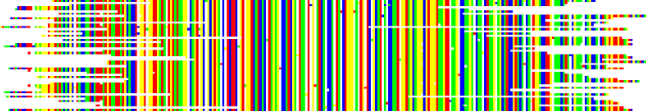
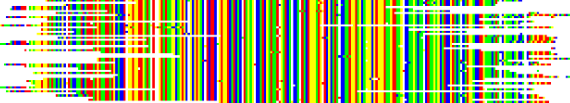

PAGAN: pileup alignment<a name="top"></a>
=======================

 

PAGAN can make "pileup" alignments by adding the sequences in the order their appear in the input file. This is not recommended for distantly-related sequences but can be useful for highly similar sequences that require alignment. This may be relevant e.g. in the analysis of overlapping noisy reads from the same locus; if the reads have been generated on Roche 454 or Ion Torrent platform, PAGAN's ability to model the homopolymer errors is especially useful.

* * *

*   [Pileup alignment without a guide tree](#pileup-alignment-without-a-guide-tree)
    *   [Example of pileup alignment of 454 reads](#example-of-pileup-alignment-of-454-reads)
*   [Pileup alignment with strand search and ORF search](#pileup-alignment-with-strand-search)

[Back to PAGAN front page](../README.md)

#### Pileup alignment without a guide tree

Like in any alignment also in a pileup alignment the consensus sequence (the alignment of sequences included so far) and the next sequence to be added should overlap. PAGAN can include sequences that do not overlap but the region in between has to be bridged by other sequences and thus the order of adding the sequences can be important. If the sequences are from the same species, the option to reconstruct the consensus sequence can also be useful.

The pileup alignment is done by selecting option ```--pileup-alignment``` and defining the input file with ```--queryfile query_sequence_file```. Typically one would also add option ```--use-consensus``` to specify that the character states are based on consensus, not the last-added and possibly incorrect sequence (e.g. due to contamination of the data), and to output the final consensus sequence. If the sequences are from Roche 454 or Pacific Biosciences CLR, one may also add option ```--454``` or ```--pacbio``` to tune the parameters specifically for those instruments; many other options are naturally compatible with the pileup alignment, too.

The many options needed for this can be defined in a config file. Assuming that the file ```454.cfg``` contains the following:

```
454 = 1
pileup-alignment = 1
use-consensus = 1
build-contigs = 1
no-terminal-edges = 1
```

the pile-up alignment for a set of 454 data can then be generated with the command:

```
./pagan 454.cfg --queryfile reads_file --outfile output_file
```

##### Example of pileup alignment of 454 reads

The PAGAN download files contain an example dataset for pileup alignment of overlapping 454 reads. The dataset can found in directory [examples/454_pileup](../examples/454_pileup). The following file is included:

*   ```454_reads.fas``` : simulated overlapping 454 reads

The data can be analysed using the following command:

```
pagan --pileup-alignment --use-consensus --454 --queryfile 454_reads.fas --outfile 454_reads_pagan
```

The resulting alignment will be written to file ```454_reads_pagan.fas```.

Using the config file from above, a similar analysis could be performed with the command:

```
pagan 454.cfg --queryfile 454_reads.fas --outfile 454_reads_pagan
```

The modelling of homopolymer error has an impact even in the alignment of relatively clean data:

PAGAN alignment

[](data/454_reads_pagan.png)

Alignments with other popular MSA methods

[](data/454_reads_mafft.png)

[](data/454_reads_muscle.png)

[](data/454_reads_clustalw.png)


#### Pileup alignment with strand search and ORF search


If the correct strands of the reads are unknown, PAGAN can be run with option \--both-strands that performs both forward and reverse-complement alignment and chooses the better one:

```
pagan --pileup-alignment --use-consensus --454 --queryfile 454_reads_reversed.fas --outfile 454_reads_reversed_pagan --both-strands
```

If the strand of the reads is unknown and the reads come from protein-coding sequences (e.g. contigs from an RNA-seq experiment), PAGAN can be run with option ```--find-orfs``` that searches for open reading frames in the query (both in forward and reverse-complement strands) and chooses the one giving the best alignment:

```
pagan --pileup-alignment --ref-seqfile human.fas --queryfile input_ngs_primates.fas --translate --find-orfs --min-orf-length 30
```

The reference sequence should be DNA (and translated with option ```--translate```) or the resulting alignment cannot be back-translated to DNA. This option does not correct for reading frames and may thus not work well with data coming e.g. from 454.

In the example above, the length of the DNA sequences is 100bp and their translated length below the default limit of 50. This limit is lowered with option ```--min-orf-length``` and the translated reads get aligned. The output is written separately for translated (peptide) and back-translated (DNA) data.

   
The dataset above can found in directory [examples/ngs_placement](../examples/ngs_placement).  
 

[back to top](#top)